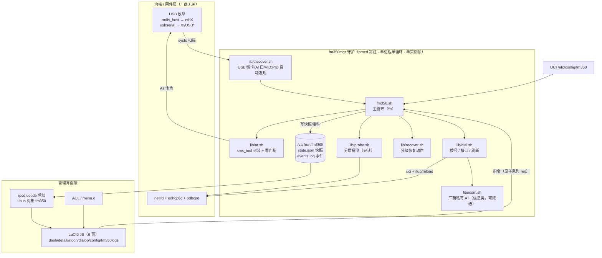
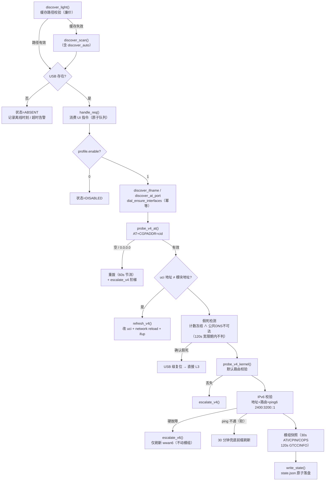
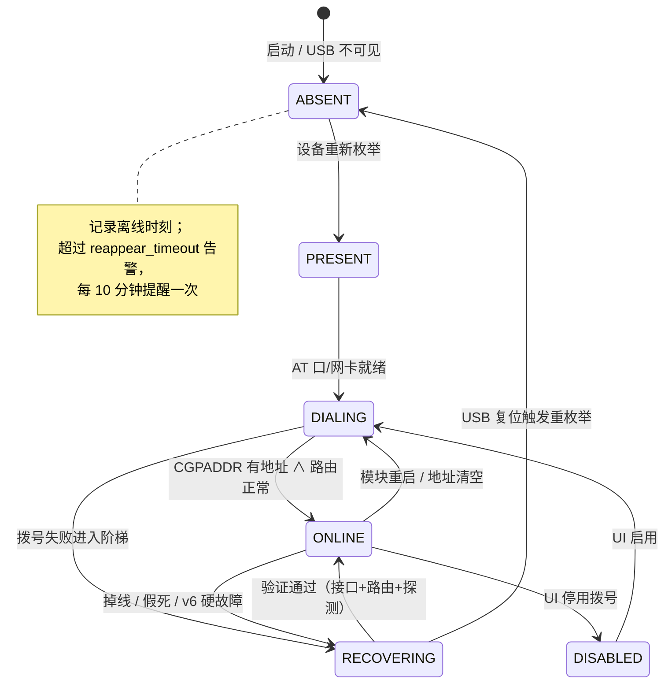
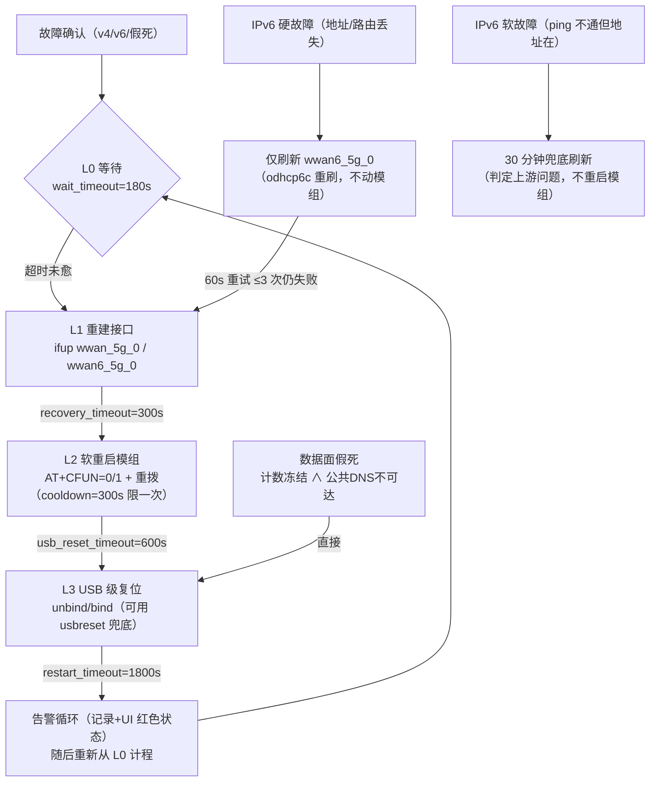
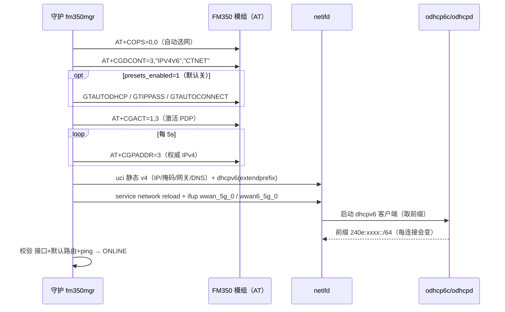
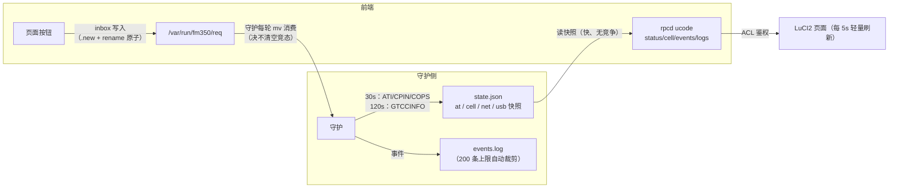

# FM350-GL 管理器（luci-app-fm350）

ImmortalWrt 24.10 / 25.12 上的 Fibocom FM350-GL 5G 模组管理器：**拨号生命周期的唯一 owner + 分级自动恢复 + 模块全自动发现 + LuCI2 中文管理界面**。

面向的固件缺陷（本模块固件层面无法修复）：每 1~3 小时随机 USB 断开/假死（AT 与 PDP 活着但数据面冻结）；运行久后 IPv6 不自动刷新（IPv4 正常、IPv6 失效）；模块可能被拔线/移位。本管理器将上述问题的**感知、分级恢复、配置化**全部自动化。

| 项 | 值 |
|---|---|
| 目标固件 | ImmortalWrt 24.10.5 x86_64（kernel 6.6.122，opkg）与 25.12.x（kernel 6.12.94，apk） |
| 模组 | Fibocom FM350-GL，USB `0e8d:7127`（**VID:PID 亦自动识别**，无需预知） |
| 数据面 | RNDIS → `eth2`（netifd 静态 v4 + dhcpv6/odhcp6c） |
| 包名 | `luci-app-fm350`（当前 r36）；离线安装按体系分两份：`dist/deps-ipk/`（24.10 · opkg）、`dist/deps-apk/`（25.12+ · apk） |
| 业务链路 | AT 口 `/dev/ttyUSB1`（自动探测）、APN ctnet、PDP ipv4v6、上下文 3 |
| 许可证 | **GPL-3.0-only**（`LICENSE`；为什么不是 MIT 见 [docs/licenses.md](docs/licenses.md)） |

---

# 第一部分 · 完整工作原理

## 1.1 组件架构



**分层原则**：恢复动作与探测完全厂商无关；厂商私有内容只有三个函数（`AT+GTDNS` 取 DNS、`AT+GTCCINFO` 取信号/小区、可选预设 `GTAUTODHCP/GTIPPASS/GTAUTOCONNECT`），**失败时全部降级**（DNS 用公共兜底、信号显示原始串），不影响上网主链路。

## 1.2 主循环（每 5s 一轮，唯一状态机）



## 1.3 三个"全自动"发现（不依赖任何固定值）

| 发现项 | 机制 | 失效/复位后的表现 |
|---|---|---|
| **USB VID:PID** | 配置 `usb_vid_pid` 留空 = 自动：遍历 USB 设备（排除 hub）→ 对各自串口探测 `ATI` 应答特征（`FM350\|Fibocom\|Manufacturer`）→ 命中即模组，读取其 VID:PID/路径/设备节点 | 换口/换机型无需改配置；识别结果缓存进 `state.usb.vid/pid` 并在事件日志留痕 |
| **网卡名** | `RNDIS/ECM` 网卡位于设备路径 `*/net/*`（回退 `/sys/class/net` 反查 device 归属）→ 自动得到 `ethX`；变化时自动重建 netifd `device=` 绑定 | 端口漂移、`eth2→eth0` 均自适应 |
| **AT 口** | 配置留空：遍历 `/dev/ttyUSB*` 探测 `ATI`（带看门狗）；自动识别命中时其串口直接作为 AT 口；全扫带 60s 冷却 | 重枚举后编号漂移无碍（实测 `ttyUSB1`↔`ttyUSB4` 漂移） |

> 手动兼容：三项均可通过配置显式指定（`usb_vid_pid=0e8d:7127`、`at_port=/dev/ttyUSB1`）。

## 1.4 状态机（对外状态 = `state.json.state`）



状态含义：`ABSENT` 模块离线 ｜ `PRESENT` 已发现待拨号 ｜ `DIALING` 拨号中 ｜ `ONLINE` 在线 ｜ `RECOVERING` 恢复流程进行（含 `problem` 细分：`v4/v6/data/absent` 与恢复级别）｜ `DISABLED` 用户停用。

## 1.5 分级恢复阶梯（"对症下药"核心）



设计要点：

- **每一级动作后必须重新探测验证**，成功即归位 `ONLINE`，失败才升级；全程**不触碰 `lan`**；
- **假死专项**：判据为"网卡计数冻结 **且** 公共 DNS（默认 202.101.224.69）不可达"——`ping` 网关不做判据（实测 CTNET 网关 ICMP 被过滤，健康会话也 100% 丢包）；计数在动而 ping 不通视为上游问题，**绝不动模组**；
- **宽限期**：重拨/换 IP/USB 复位后 120s 内不判假死（避免刚上线的新会话被误复位），`sess_since` 持久化到 state，守护重启不丢；
- **IPv6 专项**：默认只 `ifdown/ifup wwan6_5g_0`（秒级、不断 IPv4），连续失败才升级；软故障只做 30 分钟兜底刷新；
- 所有动作节流幂等（`cooldown`），任何时刻至多一个执行者（单实例锁 + 指令队列）。

## 1.6 拨号与网络建立时序



地址变化即**热刷新**：`CGPADDR` 与 uci 不一致 → 更新 uci（新 IP/网关 `${ipv4%.*}.1`/运营商 DNS）→ reload + ifup，无需重启模组。

## 1.7 UI 数据流与指令队列（零竞争设计）



- **UI 永不直接抢串口**：模组信息走守护快照（`status`/`cell` 后端"快照优先"），只有 AT 控制台是用户主动的实时执行（带 15s 看门狗 + 20s 无响应告警）；
- **指令队列原子化**：前端写 `req.new` 后 `rename` 生效，守护 `mv req req.done` 消费——两侧均不会读到半成品（历史教训：`open('w')` 截断会与读取竞态产生空指令）。

## 1.8 文件与日志治理（防膨胀）

| 对象 | 策略 |
|---|---|
| `events.log` | 超过 `events_keep`（默认 200）自动删最旧行 |
| 日志页显示 | 仅渲染最近 80 行/条 |
| AT 临时文件 | 每进程固定单文件复用 + RPC 用后立即清空 + 守护启动 `cleanup_stale()` 清理（实测治理前 100 文件/420KB → 治理后 28KB/1 个非空） |
| 系统 syslog | 由系统 logd 环形缓冲管理；本包仅事件级输出 |

## 1.9 部署与运维规范

```bash
# 远程构建 · ipk（ImmortalWrt 24.10 / opkg：开发服务器 docker + ImmortalWrt SDK 24.10.6）
# （另见 build/build-apk.sh：构建机 <build-host> 直跑 OpenWrt 25.12 官方 SDK 出 apk，无需 docker）
sh build/build.sh                      # 产物 dist/luci-app-fm350_<ver>_all.ipk

# 远程构建 · apk（OpenWrt 25.12+ / apk：构建机 <build-host> 直跑官方 SDK）
sh build/build-apk.sh                  # 产物 dist/luci-app-fm350-<ver>-r<rel>.apk（PKGARCH=all）
# 目标固件是 ImmortalWrt 时用它的 SDK（默认就是）：FM350_SDK_FLAVOR=immortalwrt
# 刷新 apk 离线依赖包（换固件版本/ABI 后必做）：sh build/fetch-deps-apk.sh
# 校验产物（假根安装 + 逐文件比对）：sh build/verify-apk.sh

# 路由器安装 · 24.10/opkg（离线：先在联网机器上下依赖，见 1.10.1）
sh dist/deps-ipk/download.sh
tar -czf - -C dist/deps-ipk . | ssh root@<router> "mkdir -p /tmp/deps-ipk && tar -xzf - -C /tmp/deps-ipk"
ssh root@<router> "sh /tmp/deps-ipk/install_all.sh"

# 路由器安装 · 25.12/apk（离线：同上，见 1.10.2）
sh dist/deps-apk/download.sh
tar -czf - -C dist/deps-apk . | ssh root@<router> "mkdir -p /tmp/deps-apk && tar -xzf - -C /tmp/deps-apk"
ssh root@<router> "sh /tmp/deps-apk/install_all.sh"

# 日常运维（务必只用 restart；勿手动 kill/start，procd respawn 会与之叠加出双实例）
ssh root@<router> "/etc/init.d/fm350mgr restart"
```

> **两套体系不可互换**：包内文件一致（29 个文件逐字节相同），差别只在安装体系与内核依赖 ——
> 25.12 起包管理器由 opkg 换成 apk（apk-tools 3），自建包不在官方密钥内，必须 `apk add --allow-untrusted`；
> 官方/ImmortalWrt x86/64 镜像**不含任何 `kmod-usb-*`**（USB 主控 / RNDIS / 串口驱动全要装），
> 而 kmod 与内核 ABI 强绑定（24.10 = 6.6.122，25.12.1 = 6.12.94）。
> 离线安装两套做法见 **1.10**，依赖清单与来源见各自的 `dist/deps-*/README.md`。

- **单实例锁**：`daemon.pid` + 存活校验，第二实例自动退出（日志：`已有守护实例运行中`）；
- 安装脚本内置：卸旧包（先 i18n 后主包，`--force-depends` 兜底）、`rpcd restart`（否则 RPC 对象不注册）、uhttpd `no_cache=js`、静态资源 `touch`（破解浏览器启发式缓存）；
- 恢复演练与回滚：`deploy/simulate.sh`（IPv6/IPv4/拔线三场景）、`deploy/rollback_fm350.sh`；
- 参考存档：`baseline/`（旧链路完整存档，**第三方参考件，不入库**，见 `.gitignore`）、`dist/deps-ipk/README.md` 与 `dist/deps-apk/README.md`（两套依赖的版本与来源）。

---

## 1.10 离线安装（路由器不联网）

两套体系各一份离线安装目录，**互不通用**（内核 ABI 与包管理器都不同）。
仓库**不含任何二进制**（含第三方 GPL 二进制与自建包）：依赖由 `download.sh` 在联网机器上按
`SHA256SUMS` 现取并校验，自建包由 `build/` 下的脚本编译——所以仓库里只有脚本与清单。

| | `dist/deps-ipk/` | `dist/deps-apk/` |
|---|---|---|
| 目标固件 | ImmortalWrt **24.10.x** x86_64 | ImmortalWrt **25.12.x** x86_64 |
| 内核 / kmods ABI | 6.6.122 / `6.6.122-1-e7e50fbc…` | 6.12.94 / `6.12.94-1-0413601b…` |
| 包管理器 | opkg（`.ipk`） | apk-tools 3（`.apk`） |
| 依赖清单 | 17 个（`SHA256SUMS` 内） | 19 个（`SHA256SUMS` 内） |
| 取依赖 | `sh download.sh`（联网机器） | `sh download.sh`（联网机器） |
| 装 | `install_all.sh`（`opkg install`） | `install_all.sh`（`apk add --network=no`） |
| 许可证 | 见 [docs/licenses.md](docs/licenses.md) | 同左 |

两个安装脚本结构相同：**预检**（固件自带基础包 + 内核/ABI）→ **校验 `SHA256SUMS`** → 装依赖 →
装主包 → `rpcd restart` + uhttpd `no_cache=js` → 启守护并打印状态（含 ubus 对象是否注册）。
预检不通过或校验失败会**明确报错并退出**，不会留下半装状态。

> 传输用 `tar` 管道而不是 `scp`：OpenWrt 的 dropbear 不带 sftp-server，新版本 OpenSSH 客户端走 SFTP 协议会直接失败。

### 1.10.1 ipk 离线安装（ImmortalWrt 24.10 及以前 · opkg）

```sh
# 1) 联网机器：下依赖（约 7 秒）并编译主包放进本目录
sh dist/deps-ipk/download.sh
sh build/build.sh && cp dist/luci-app-fm350_*.ipk dist/deps-ipk/

# 2) 送到路由器 → 离线安装
tar -czf - -C dist/deps-ipk . | ssh root@<router> "mkdir -p /tmp/deps-ipk && tar -xzf - -C /tmp/deps-ipk"
ssh root@<router> "sh /tmp/deps-ipk/install_all.sh"
```

装：`kmod-usb-{core,2,3,ehci,ohci,xhci-hcd,net,net-cdc-ether,net-rndis,serial,serial-wwan,acm,wdm}`、
`jq`、`sms-tool`、`odhcp6c`、`odhcpd-ipv6only` + 自建的 `luci-app-fm350_*.ipk`。

### 1.10.2 apk 离线安装（OpenWrt / ImmortalWrt 25.12 及以后）

```sh
# 1) 联网机器：下依赖（约 7 秒）并编译主包放进本目录
sh dist/deps-apk/download.sh
sh build/build-apk.sh && cp dist/luci-app-fm350-*.apk dist/deps-apk/

# 2) 送到路由器 → 离线安装
tar -czf - -C dist/deps-apk . | ssh root@<router> "mkdir -p /tmp/deps-apk && tar -xzf - -C /tmp/deps-apk"
ssh root@<router> "sh /tmp/deps-apk/install_all.sh"
```

装：`kmod-usb-{core,common,nls-base,2,3,xhci-hcd,ehci,ohci,net,net-cdc-ether,net-rndis,serial,serial-wwan,acm,wdm}`、
`kmod-{mii,libphy}`、`jq`、`sms-tool` + 自建的 `luci-app-fm350-*.apk`。
`kmod-nls-base` 是 `kmod-usb-core` 的依赖，漏了整条 USB 链路装不上。

> 换了固件版本（哪怕只是 25.12.1 → 25.12.2）都要**重新抓一套**：
> `FM350_VER=… FM350_ABI=… sh build/fetch-deps-apk.sh`（apk 侧；它会重写 `SHA256SUMS`），
> 主包由 `sh build/build-apk.sh` 产出。ipk 侧同理，kmod 必须与固件内核 ABI 完全一致。

---

# 第二部分 · 未来兼容性评估（其它厂商 / 型号 5G 模块）

**评估依据**：① 本项目源码的厂商耦合点静态清点（grep 实测）；② 参考文件 `baseline/modem_support.json`（ImmortalWrt luci-app-modem 1.4.4 机型库：**19 个 USB 机型 + 8 个 PCIe 机型**）与 `baseline/{quectel,meig,simcom,fibocom}.sh` 的厂商命令事实（`baseline/` 为第三方参考件，仅本地保留，未入库）。

## 2.1 结论

项目约 **85% 的代码是厂商无关的通用底座**（自动识别、分级恢复、IPv6 刷新、冻结检测、快照/UI、打包与离线依赖），换厂商只需替换极少量"厂商私有命令"；**硬边界是数据面形态：仅支持 USB 以太网类（RNDIS / ECM / NCM），不支持 QMI / MBIM 协议模式与 PCIe/MHI 形态**。

## 2.2 厂商耦合点清点（实测）

| 部件 | 内容 | 判定 |
|---|---|---|
| 拨号主序列 | `AT+COPS=0,0` → `AT+CGDCONT=<cid>,"<pdp>","<apn>"` → `AT+CGACT=1,<cid>` | **3GPP 标准，全厂商通用** |
| 地址权威值 | `AT+CGPADDR=<cid>` | **3GPP 标准，全厂商通用** |
| AT 口探测 | `ATI` 应答匹配 `OK\|FM350\|Fibocom\|Manufacturer`（`OK/Manufacturer` 为通用词） | 通用性高 |
| 数据面搭建 | netifd 静态 v4 + dhcpv6/odhcp6c + 自动发现 eth 网卡 | RNDIS/ECM/NCM 三种形态通用 |
| 恢复体系 | USB 复位、冻结检测、IPv6 刷新、自动识别 | **完全厂商无关** |
| 厂商私有（全部可降级） | `AT+GTDNS`（DNS，有公共兜底）、`AT+GTCCINFO`（信号/小区，仅展示）、`GTAUTODHCP/GTIPPASS/GTAUTOCONNECT` 预设（默认关） | **不影响上网主链路** |

## 2.3 兼容分档与型号清单（19 个 USB 机型全量映射）

### A 档 · 原生 / 近零改动（≤2 行）

Fibocom 全平台私有命令族同源（`GT*` 命令），拨号触发沿用 `AT+GTRNDIS`：

| 型号 | 平台/模式 | 说明 |
|---|---|---|
| **FM350-GL**（现役） | mediatek / rndis | 当前实现的目标 |
| **FM650-CN** | unisoc / ecm·mbim·rndis·ncm | 切 ECM/RNDIS 后可用（同 GT 命令族） |
| **FM150-AE / FM160-CN** | qualcomm / 多模式 | 切 ECM/RNDIS 后可用；ECM 下加一条 `AT+GTRNDIS` 分支 |

### B 档 · 小改即可兼容（1~3 行拨号命令；模块需处于 ECM/RNDIS/NCM 模式）

| 厂商 | 型号（机型库实测） | 需加拨号命令 |
|---|---|---|
| **Quectel 移远** | **RG200U-CN、RM500U-CN/-EA/-CNV**（unisoc）；**RM500Q-CN/-AE/-GL、RM502Q-AE/-GL、RM505Q-AE、RM520N-CN/-GL**（qualcomm） | `AT+QNETDEVCTL=1,3,1`（部分固件为 `1,1,1`，需实测微调） |
| **Meig 美格** | **SRM815、SRM825、SRM825N** | `AT^NDISDUP=1,1` |

> 切模式示例（需实测确认）：Quectel `AT+QCFG="usbnet",1`(ECM)/`3`(RNDIS)；切模后 VID:PID/网卡名/AT 口全部自动重识别，项目其余部分**零改动**。

### C 档 · 需较大改造（不建议，除非必须）

- 上述 Qualcomm 机型**保持默认 QMI/MBIM 模式**：需要 `qmi_wwan/cdc_mbim` + `uqmi/umbim` 或 ModemManager 协议栈（本项目已主动移除 MM 且无 QMI 路径，属数十行 + 新依赖工程）；
- **全部 8 个 PCIe/MHI 机型**（含 FM350-GL PCIE 版）：识别/复位/热插拔逻辑均基于 USB 树，不适用。

### D 档 · 不兼容但安全

非蜂窝 USB 设备：自动扫描凭 AT 应答白名单自然跳过，**不会误识别、不会误拨号**。

## 2.4 若做多厂商兼容：最小改造接口（评估建议，未实施）

1. UCI 增加 `profile.manufacturer`（`auto`/`fibocom`/`quectel`/`meig`；auto 按 ATI 应答判定）；
2. 拨号触发**表驱动**：`fibocom→CGACT/GTRNDIS`、`quectel→QNETDEVCTL`、`meig→NDISDUP`（每厂商 1~2 行）；
3. 厂商标识/信息文件按 `fibocom.sh` 范式并列 `quectel.sh`/`meig.sh`（DNS 与信号解析可直接参考 `baseline/` 同名脚本）；
4. **通用底座零改动**：自动识别、分级恢复、IPv6 刷新、冻结检测、UI、打包、离线依赖。

## 2.5 待实测项

- Quectel `AT+QNETDEVCTL` 参数变体与目标固件兼容性；`AT+QCFG="usbnet",…` 在目标型号的实际支持；
- Meig `AT^NDISDUP` 在 SRM8xx 的回显格式；
- 各厂商 ECM 模式下 IPv6 PD 是否照常（本项目 dhcpv6 路径预期可直接复用）。

---

# 第三部分 · 许可证

本项目以 **GPL-3.0-only** 发布：全文见 [`LICENSE`](LICENSE)（包内另附一份 `luci-app-fm350/LICENSE`）。

原因是 `luci-app-fm350/files/usr/lib/fm350/fibocom.sh` 的信号/小区换算公式与解析结构
**抽取并修改自** [luci-app-modem](https://github.com/qianlyun123/luci-app-modem) v1.4.4
（作者 Siriling，`PKG_LICENSE:=GPLv3`）；按 GPLv3 §5 修改版必须以 GPLv3 授权整个作品，
并保留上游版权、标注已修改——该文件头部已带完整声明。**因此不能再标 MIT**。

各上游组件（LuCI / rpcd / jq / sms-tool / 内核模块 / odhcp6c 等）的许可证与兼容性说明见
[**docs/licenses.md**](docs/licenses.md)。仓库**不包含任何第三方二进制**，依赖由
`dist/deps-*/download.sh` 从官方源（含镜像）下载并校验，自建包由 `build/` 下的脚本编译。

---

*本 README 对应 luci-app-fm350 r36（GPL-3.0-only）；构建/安装/回滚细节见 `build/`、`deploy/`、
`docs/` 与 `dist/deps-ipk|deps-apk/README.md`。*
