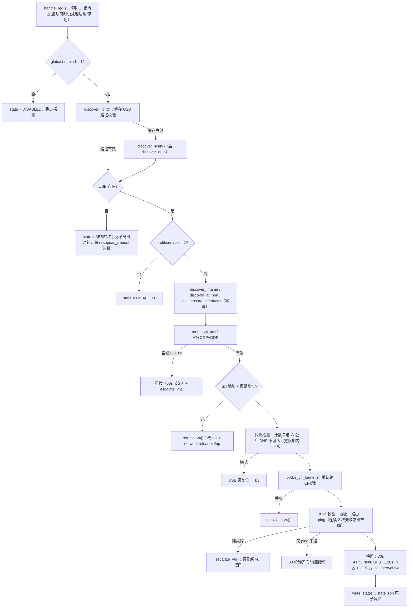
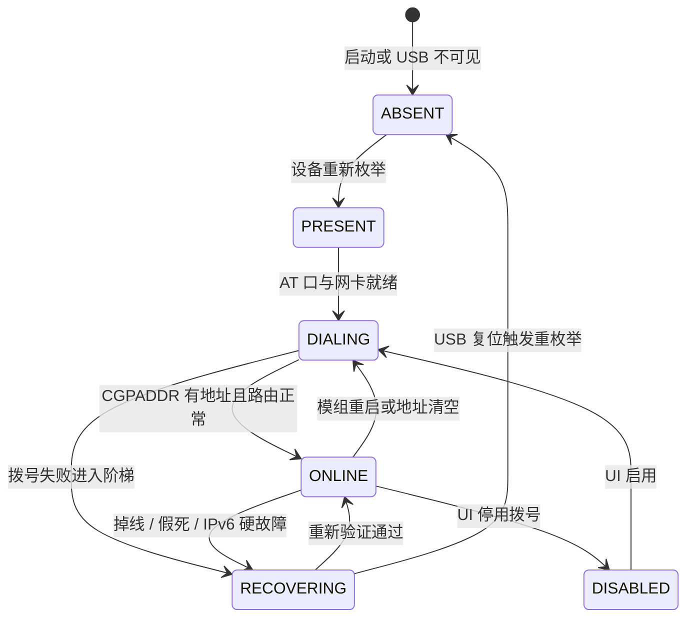
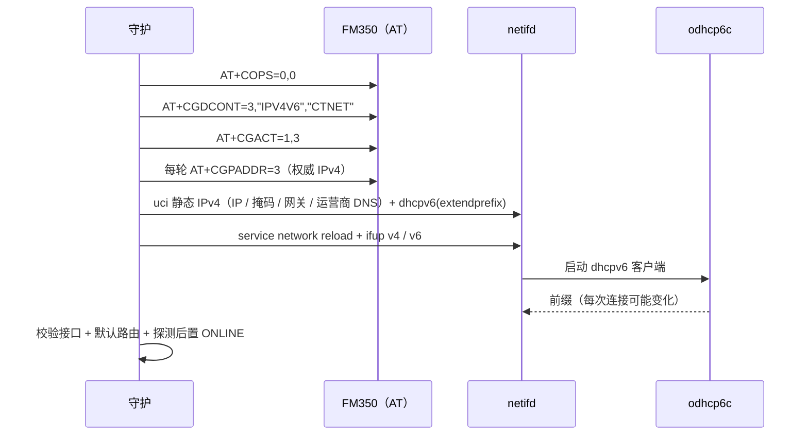

# 架构

## 组件

| 层 | 内容 |
|---|---|
| 内核 / 固件 | USB 枚举（rndis_host → `ethX`、usbserial → `/dev/ttyUSB*`）、netifd、odhcp6c / odhcpd |
| 守护 | `fm350mgr`（procd 常驻，单进程单循环，`flock` 单实例）；`fm350.sh` 主循环 + `lib/{discover,at,probe,dial,recover,config,util}.sh` + 厂商模块 `fibocom.sh` |
| 后端 | rpcd ucode `fm350`：`status`、`cell`、`events`、`logs`、`probe`（读）与 `at_exec`、`dial_op`、`events_clear`（写） |
| 前端 | LuCI2 视图 `/www/luci-static/resources/view/fm350/{board,dataview,atcon,dialpan,config,logpanel}.js`，公共模块 `/www/luci-static/resources/fm350/common.js` |
| 运行时数据 | `/var/run/fm350/{state.json,events.log,req,daemon.lock,serial.lock,at_probe.last}` |
| 配置 | `/etc/config/fm350`（包内模板 `/usr/share/fm350/config.template` 与其内容一致） |

分层约束：探测与恢复动作不依赖厂商；厂商私有内容只有 DNS（`AT+GTDNS`）、小区与信号（`AT+GTCCINFO`、`AT+CESQ`、`AT+GTCAINFO`）以及可选预设（`GTAUTODHCP` / `GTIPPASS` / `GTAUTOCONNECT`，默认关闭）。厂商调用失败时降级：DNS 用公共兜底、信号显示原始回显。

## 主循环

每 `global.interval`（默认 5s）一轮，先 `load_config` 加载一次配置，再处理指令。

## 状态机

`state.json.state` 是对外状态，另外带 `problem`（`v4` / `v6` / `data` / `absent`）、`recovery_level` 与 `elapsed`。

## 分级恢复

| 级别 | 动作 | 触发条件（默认） |
|---|---|---|
| L0 | 等待自愈 | `wait_timeout` 180s |
| L1 | `ifup` 重建 `v4_ifname` / `v6_ifname` | 超过 L0；L1 内每 60s 重试一次 |
| L2 | `AT+CFUN=0/1` 软重启模组后重拨 | `recovery_timeout` 300s，受 `cooldown` 300s 节流 |
| L3 | USB 级复位（`unbind`/`bind`，必要时 `usbreset`） | `usb_reset_timeout` 600s；受 `cooldown` 与 `usb_reset_enabled` 约束 |
| L4 | 告警循环，重新从 L0 计程 | `restart_timeout` 1800s |

专项路径：

- 数据面假死：`frozen_enabled=1` 时，若网卡计数在 `frozen_sample`（30s）内无变化且公共 DNS 不可达，直接执行 USB 复位（跳过 L0~L2）。计数在动但 ping 不通视为上游问题，不动模组。重拨、换地址或复位后 `frozen_grace`（120s）内不判定。
- IPv6 硬故障（地址或默认路由丢失）：只刷新 v6 接口（`odhcp6c`），每 60s 一次、连续 3 次失败且 `ipv6_escalate=1` 时升级为整体恢复。
- IPv6 软故障（地址在但 ping 目标 `2400:3200::1` 连续 2 次不通）：30 分钟兜底刷新一次前缀，不重启模组。

每一级动作之后都必须重新探测验证：通过则 `recover_done` 归位，否则继续升级。恢复流程不修改 `lan`。

## 拨号时序

`profile.presets_enabled=1` 时拨号前额外下发 `GTAUTODHCP` / `GTIPPASS` / `GTAUTOCONNECT`。地址变化即热刷新：更新 uci 后 reload 并 ifup，不重启模组。

## 发现机制

| 项 | 机制 | 失效后的行为 |
|---|---|---|
| USB VID:PID | `usb_vid_pid` 留空时遍历 USB 设备（排除 hub），对各自串口探测 `ATI` 特征串，命中即模组 | 换口、换机型无需改配置；结果写入 `state.usb.vid/pid` |
| 网卡名 | 设备路径下 `*/net/*`，回退 `/sys/class/net` 反查 device 归属 | 端口漂移时自动重建 netifd 绑定 |
| AT 口 | 自动识别时用命中模组的串口；否则遍历 `/dev/ttyUSB*` 探测 `ATI`，全扫描带 60s 冷却 | 重枚举后编号漂移无碍 |

三项都可用配置显式指定（`usb_vid_pid=0e8d:7127`、`at_port=/dev/ttyUSB1`）。

## UI 数据流与指令邮箱

- 读：守护按周期把 `ATI`/`CPIN`/`COPS`/小区/CESQ/CA 结果写入 `state.json`，`status`、`cell` 只读快照，不占用串口。
- 写：页面按钮把指令写入单槽邮箱 `/var/run/fm350/req`（生产者与消费者共享 `request.lock`）。已有未消费指令时返回「忙」，不覆盖；消费者先 `mv req req.done` 再读取。入队成功不等于操作完成，结果看事件日志。
- 串口互斥：所有 AT 调用共享 `serial.lock`，等待上限 20s，单次执行默认 8s（AT 控制台 15s，前端 40s 无响应提示）。

## 文件与日志治理

| 对象 | 策略 |
|---|---|
| `state.json` | 写临时文件后 `mv` 原子替换 |
| `events.log` | 超过 `events_keep`（默认 200）删除最旧行 |
| AT 临时文件 | 每次调用独立临时文件，退出或超时后删除 |
| 日志页 | 仅渲染最近 80 行 |
| 系统日志 | 交给 logd 环形缓冲，本包只输出事件级记录 |
